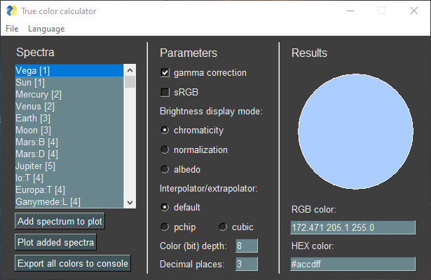

# True Color Tools
A set of Python scripts for calculating human-visible colors of celestial bodies by spectra and color indices.

### Tools:
- [`tool_true-color-calc.py`](Scripts/tool_true-color-calc.py) calculates colors of one or several objects and build their spectra;
- [`tool_true-color-calc_GUI.py`](Scripts/tool_true-color-calc_GUI.py) calculates colors much more conveniently with a graphical interface and visualization;
- [`tool_true-color-table.py`](Scripts/tool_true-color-table.py) generates a customizable table of the celestial bodies' colors.

### Auxiliary:
- [`config.py`](Scripts/config.py) automatically detects the system language and the main folder for other scripts;
- [`convert.py`](Scripts/convert.py) contains everything that is directly related to calculations (functions, zero points of photometric systems, used curves of color space and sensitivity of human perception);
- [`spectra.py`](Scripts/spectra.py) is a database of spectra, color indices and their sources;
- [`translator.py`](Scripts/translator.py) contains almost all used inscriptions of other scripts in supported languages.

## Requirements
You need Python 3.6 or higher (due to f-strings) and probably Windows (due to system calls in [`config.py`](Scripts/config.py)). No internet connection is required for all scripts to work.

Also, you need [NumPy](https://numpy.org/), [SciPy](https://www.scipy.org/), [Pillow](https://pillow.readthedocs.io/), [Plotly](https://plotly.com/python/) and [PySimpleGUI](https://pysimplegui.readthedocs.io/). If you use Anaconda, the first 4 libraries are already preinstalled. You can (wasn't checked) install the libraries all at once using [`requirements.txt`](requirements.txt):
```py
python -m pip install -r requirements.txt
```

## FAQ
> ***How can I get formatted colors for Celestia?***

Celestia uses chromaticity values from 0 to 1 for each color channel, where 1 is the value of the brightest channel. In the GUI version, you need to make sure that the `chromaticity` mode is used and `Decimal places` is greater than zero (by default it is), and then set the `Color (bit) depth` parameter to zero.


> ***How do I add my own spectrum?***

Add it to the dictionary `objects` in [`spectra.py`](Scripts/spectra.py). It can be in two forms, for spectra or color indices:
```py
"Object name": {
  "nm": [], # list of wavelengths in nm
  "br": [] # same-size list of reflectivity
}
"Object name": {
  "filters": "", # one from convert.py → filters
  "indices": {"": 0, …, "": 0} # min wavelength color index → max wavelength color index
}
```
Optional parameters:
```py
"albedo" # True (if reflectivity values are albedo values), False, or value (in V band or on 550 nm)
"sun" # True (if it's a spectrum with solar reflection) or False
"obl" # oblateness (from 0 to 1)
"tags" # not used for now
```

> ***How can I choose a language?***

The scripts use the system language by default (tested only on Windows). However, it can be specified manually in the function (same with the main folder path, [`config.folder()`](Scripts/config.py)).
```py
lang = config.lang() # system language
lang = config.lang("ru") # the same as config.lang("Russian") and config.lang("Русский")
```

> ***Why it crashes if I choose German?***

German is a stub in the file for storing titles in different languages, [`translator.py`](Scripts/translator.py). If someone wants to add support for any language, this can be done simply.

## Images

### True color calculator GUI


### Color table (not gamma corrected)
